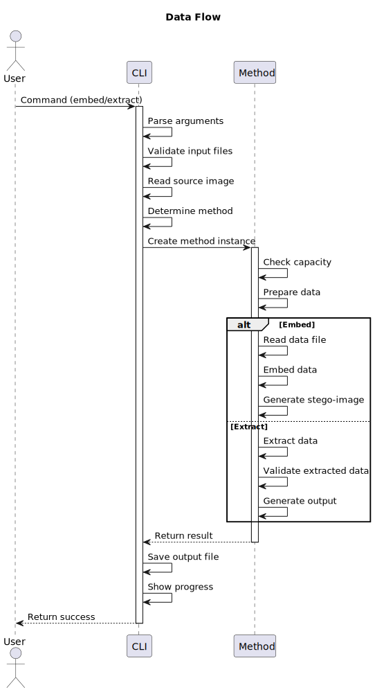
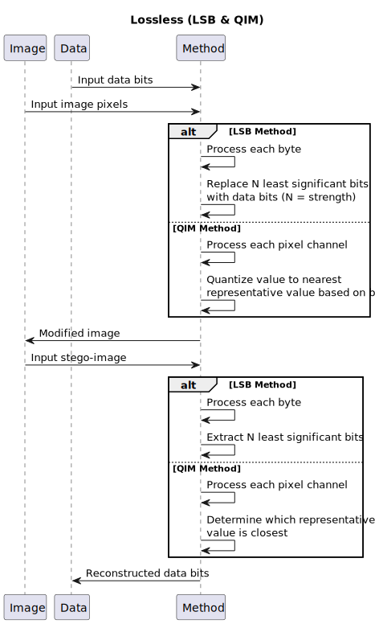
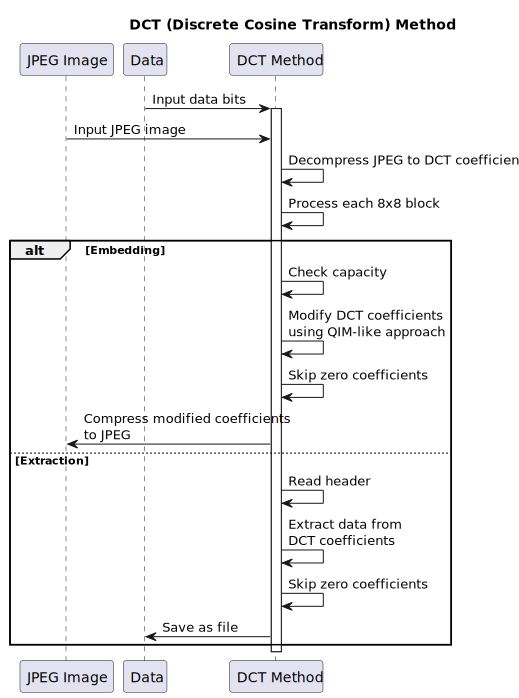
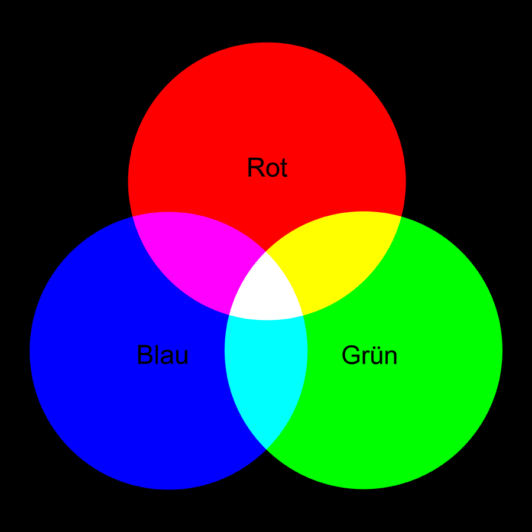
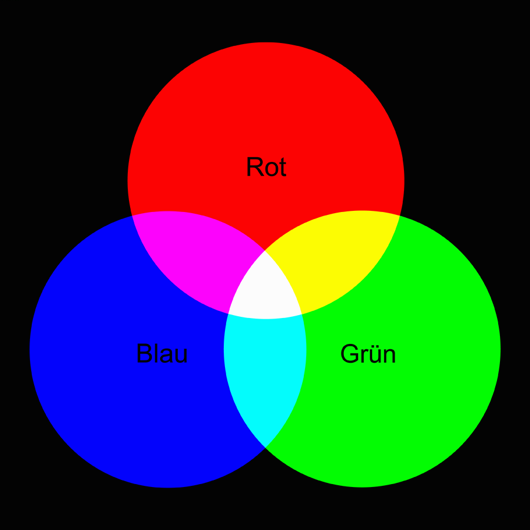
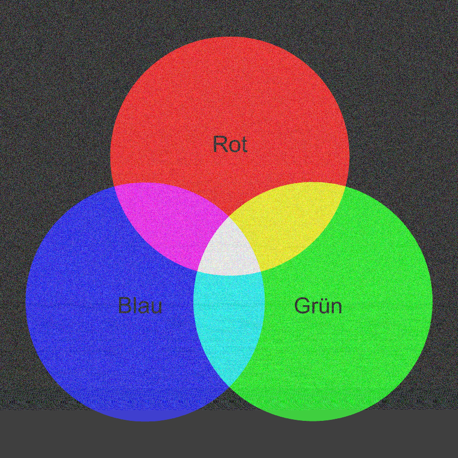

# DeepData
## CLI Tool for hiding files in images using Steganography

`deepdata` is a command-line utility written in C# that allows hiding any file inside an image (JPG, PNG, BMP) and extracting it later.  
It supports multiple steganography methods including LSB, QIM, and JPEG DCT coefficient manipulation.

---

## Features
- Hides any files inside **PNG**, **BMP**, or **JPEG/JPG** images
- Extracts hidden files from stego-images
- Supports multiple steganography methods:
  - `LSB` (Least Significant Bit) for lossless formats
  - `QIM` (Quantization Index Modulation) for enhanced capacity
  - `DCT` (Discrete Cosine Transform) for JPEG images
- Format-aware auto method selection
- Can be set up easily (channels strength etc.)
---

## Installation

### Manual
Clone and build using .NET:

```bash
  git clone https://github.com/dehobitto/DeepData.git
  cd DeepData/DeepData.CLI
  dotnet build
```

### Recommended
Download prebuilt executable file from repository releases and add to `PATH` variable

---

## Usage
If manually installed should use `dotnet run`, if the way I recommend - `deepdata`. I'll use the second one further:
### Using auto-detected method
```bash
  deepdata embed photo.jpg secret.txt --output stego.jpg
```
```bash
  deepdata extract stego.jpg --output recovered.<extension>
```
```bash
  deepdata capacity image.jpg
```

### Advanced Usage
```bash
  deepdata embed photo.jpg secret.txt --method qim --settings "channels=Y,Cb delta=4"
```
```bash
  deepdata extract stego.jpg --output recovered.<extension> --method lsb --settings "channels=R,G strength=2"
```
```bash
  deepdata capacity diagram.bmp --method lsb --settings "channels=R,G strength=2"
```

### Help and Version
```bash
    deepdata --help
    deepdata --version
```

---

## Overview

### Libraries Used

* `ImageSharp`
  - Cross-platform image manipulation library
  - Used for lossless format handling (PNG, BMP)
  - Provides efficient pixel manipulation

* `BitMiracle.LibJpeg.Classic`
  - Direct access to JPEG DCT coefficients
  - Enables precise coefficient manipulation
  - Maintains image quality during embedding

### Main Components

#### DeepData.CLI
- **Program.cs**: Entry point and command-line interface
- **Commands/**: Command implementations
  - `command` **inherits** from `BaseCommand.cs` **implements** `_ICommand.cs` 
- **Utils/**: Helper utilities and common functions

#### DeepData.Steganograph
- **Methods/**: Steganography implementations
  - `method` **inherits** from `StegoMethod` **implements** `IStegoMethod`
    - `Lsb.cs`
    - `Qim.cs`
    - `Dct.cs`
- **Utils/**: Shared utilities
- **Settings/**: Configuration handling

### Application Structure

```
DeepData/
├── DeepData.CLI/               # Command-line interface
│   ├── Commands/               # Command implementations
│   ├── Utils/                  # CLI utilities
│   └── Program.cs              # Entry point
├── DeepData.Steganograph/      # Core steganography logic
│   ├── Methods/                # Steganography methods
│   ├── Interfaces/             # Core abstractions
│   ├── Models/                 # Data structures
│   ├── Utils/                  # Shared utilities
│   └── Extensions/             # Extension methods
```

### Component Interaction

1. **CLI Layer** (`DeepData.CLI`)
   - Parses user commands and arguments
   - Validates input parameters
   - Handles image format detection
   - Routes to appropriate steganography methods

2. **Core Logic Layer** (`DeepData.Steganograph`)
   - Implements steganography algorithms
   - Manages data embedding/extraction
   - Provides progress reporting

3. **Method Layer** (`Methods/`)
   - LSB: Bit-level manipulation for lossless formats
   - QIM: Enhanced capacity through quantization
   - DCT: JPEG-specific coefficient manipulation

---

## Program Flow

### Main Flow



<details>
  <summary>Description</summary>

**Start:**
- User → CLI: Command (embed/extract)  
- CLI: Parse arguments, validate input files, read source image, determine method  
- CLI → Method: Create method instance  
- Method: Check capacity, prepare data  
- **If Embed**:  
  - Read data file, embed data, generate stego-image  
- **Else Extract**:  
  - Extract data, validate extracted data, generate output  
- Method → CLI: Return result  
- CLI: Save output file, show progress  
- CLI → User: Return success  

</details>

---

### Lossless Methods (LSB & QIM)



<details>
  <summary>Description</summary>

**Start:**
- Data → Method: Input data bits  
- Image → Method: Input image pixels  
- **If LSB**:  
  - Replace N least significant bits with data bits  
- **Else QIM**:  
  - Quantize value to nearest representative  
- Method → Image: Modified image  
- Image → Method: Input stego-image  
- **If LSB**:  
  - Extract N least significant bits  
- **Else QIM**:  
  - Determine which representative is closest  
- Method → Data: Reconstructed data bits  

</details>

---

### Lossy Method



<details>
  <summary>Description</summary>

**Start:**
- Data → DCT: Input data bits  
- Image → DCT: Input JPEG image  
- DCT: Decompress to DCT coefficients  
- DCT: Process 8×8 blocks  
- **If Embedding**:  
  - Check capacity  
  - Modify DCT with QIM  
  - Skip zero coefficients  
  - → Image: Compress to JPEG  
- **Else Extraction**:  
  - Read header  
  - Extract from DCT  
  - Skip zero coefficients  
  - → Data: Save as file  

</details>


## Examples

### Lsb showcase
We will see clearly how the lsb parameters affects the image.

| Original | Strength = 2 | Strength = 6 | Strength = 6 R,G |
|----------|--------------|--------------|------------------|
|  |  |  |  |

### Dct showcase
We will see clearly how the dct parameters affect the image.

| Original                               | Delta = 10                              |
|----------------------------------------|-----------------------------------------|
|        |  |

| Delta = 20                              | Delta = 40 Cb,Cr                            |
|-----------------------------------------|---------------------------------------------|
|  |  |